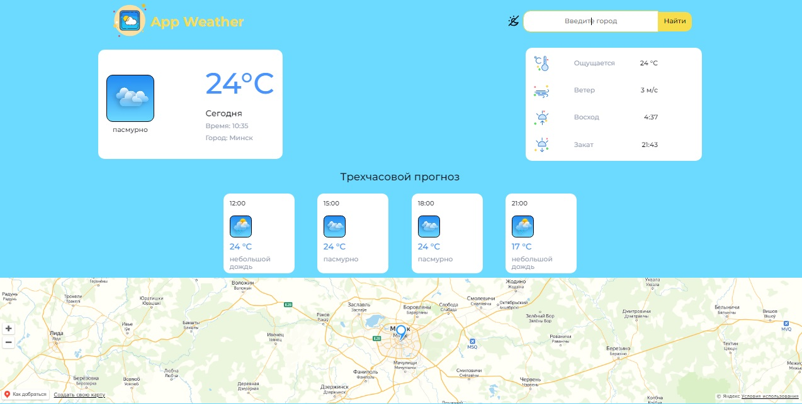

# App_Weather

###[Deploy](https://0-app-weather-0.netlify.app/)

### Функционал:

По введенному названию города (на русском или на английском) показывает погоду на текущий момент и трехчасовой прогноз погоды. Показывается карта с меткой на текущий город. Можно включить светлую/темную тему сайта.

### Используемые технологии:

- JS/React
- SASS
- Normalize
- React-icon
- Redux-toolkit
- Axios
- API Weather
- API YandexMaps
